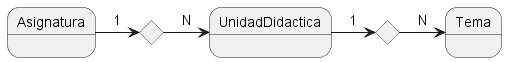
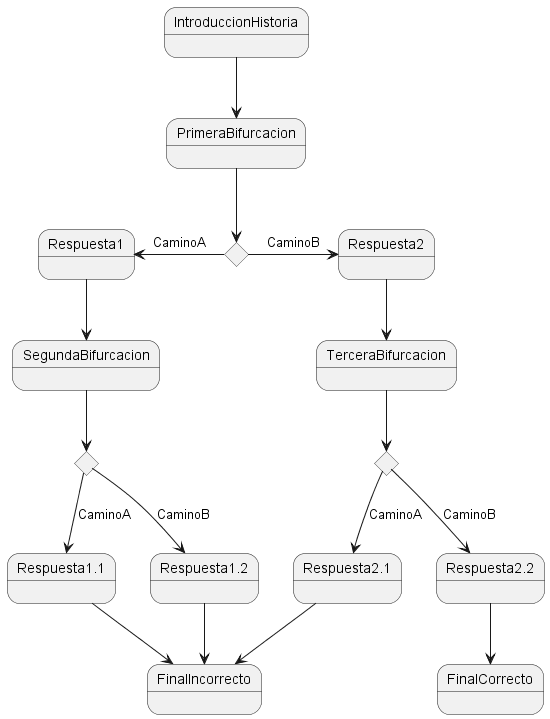

# Glosario conceptos
### Asignatura
Definición formal: <em>Cada una de las asignaturas que enseñan en un centro docente o forman un plan académico de estudios.</em>

En este ámbito sería algo como una categoría específico de conocimiento, funcionando como unidad organizativa que agrupa contenido relacionado.

El modelo entidad-relación sería de la siguiente forma en la estructura:
 

### Unidad didáctica
Definición formal: <em>Es la planificación de lsa actividades de aprendizaje en relación con el resto de elementos de la programación docente.</em>

En este ámbito estaría relacionado a la creación de una estructura educativa, que se utilizaría de manera organizativa y para planificar el proceso de enseñanza-aprendizaje de un <em>contexto</em> específico. Compuesto de varios temas o unidades más pequeás, agrupados de manera coherente y secuencial para abordar un objetivo educativo general.

### Tema
Definición formal: <em>Cad una de las unidades de contenido en que se divide un programa de estudios o de una oposición, o un libro de texto.</em>

En este ámbito es un área específica de contenido o conocimiento, que se aborda de manera individual dentro de cada unidad didáctica. Son pequeñas unidades que componene el plan de estudios y se centran en un conjunto particular de conceptos, habilidades o información.
### Logro
Reconocimiento o premio virtual que se otorga a los usuario por alcanzar ciertos hitos, objetivos o niveles dentro de la plataforma.
Son una forma de motivar a los usuarios y recompensar el progreso, creando así una experiencia más atractiva y gratificante.
Logros hablados:

* Logros por progreso
    * Por acabar temas/unidades didácticas
    * Por % de aciertos en tests
    * Por días consecutivos realizando las actividades

### Tipos de tests

* Por asignatura
* Por unidad didáctica
* Por tema
* Por preguntas no respondidsa correctamente
* Aleatorio (eligiendo el número de preguntas)
    * Por unidad didáctica
    * Por asignatura

### Extras
Como extras de la aplicación se había contemplado lo siguiente:

* Modo historia. En la que se desarrolla una historia y el usuario tiene la capacidad de interactuar directamente sobre ella, con una estructura similar a:
 

 

* Resumen de la cuenta. Un esquema de la cuenta, mostrando gráficamente los distintos avances en las distintas asignaturas/unidades didácticas/tema.
 

* Modo difícil. Test extras que se podrían añadir con complicaciones suplementarias, tales como contador de tiempo, preguntas más "difíciles"... etc.
 

* Desafíos semanales

